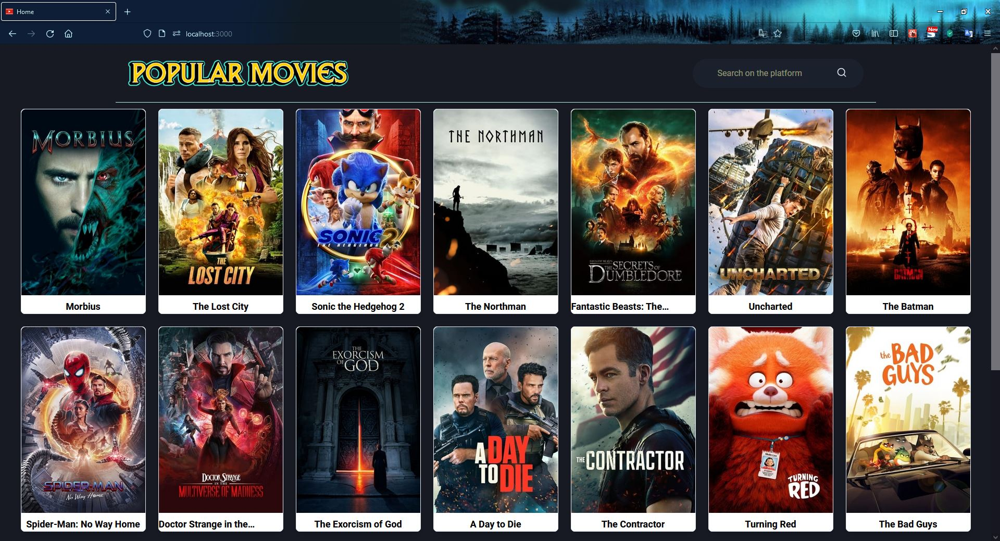
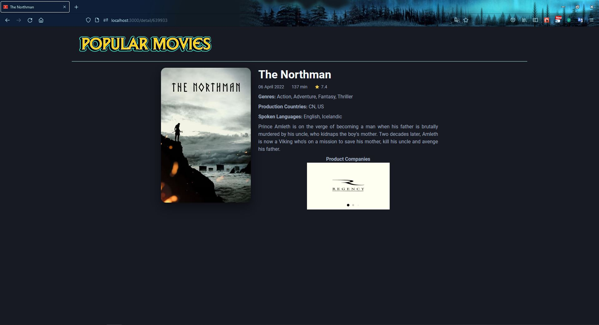

<p align="center" width="100%">
  
</p>

## :sparkler: Aplicação

Está aplicação foi desenvolvida com o intuito de fixar alguns tópicos, aprendidos na trilha React JS do Ignite, sobre as seguintes tecnologias:

  - [Next](https://nextjs.org/)
  - [Chakra UI](https://chakra-ui.com/)
  - [React JS](https://pt-br.reactjs.org/)

Os tópicos que foram estudados estão relacionados aos Next e são:

  - **_getServerSideProps_**: é executado na camada do server e não do browser. É mais usados em situações mais dinâmicas onde precisa fazer uma chamada diferente para cada usuário logado, por exemplo, e não se sabe a quantidade.
  - **_getStaticProps_**: é mais utilizado quando sabe a quantidade de dados que será carregado na tela, como exemplo posts de um blog. E um ponto interessante é que, na primeira vez que redenrizar a página, o Next salva o html como um arquivo físico de forma estática. Então, quando for atualizar a página, ao invés de fazer uma nova chamada, retorna o que foi salvo no _getStaticGeneration_, assim não precisa fazer do zero o que torna a página mais performática. Além disso, pode configurar para ser recarregado de tempos em tempos se for necessário.
  - **_getStaticPaths_**: usado quando há utilização de rotas dinâmicas. Todas as rotas que forem salvas aqui, ocorrerá uma pré-renderização antes. Deve ser usado com o _getStaticProps_ e não pode ser usado com o _getServerSideProps_. É necessário passar um fallback que pode ser true, false ou blocking.

Na aplicação foram utilizados apenas o _getStaticProps_ na Home, para o carregamento da lista de filmes, e o _getStaticPaths_, pois ao clicar em um dos cards dos filmes, o usuário é direcionado para a tela de detalhes. 

API dos filmes: [TMDB](https://www.themoviedb.org/documentation/api)

## :white_check_mark: Features

  - [x] Listar filmes
  - [x] Pesquisar filme
  - [x] Carregar mais filmes
  - [x] Exibir detalhes do filme  

## Instalação
```bash
yarn install
```

## Executar projeto
```bash
yarn dev
```

## ENV LOCAL

  - **NEXT_PUBLIC_API_KEY**: sua chave no TMDB.
  - **NEXT_PUBLIC_TOKEN**: seu token no TMDB.
  - **NEXT_PUBLIC_API**: api do TMDB.
  - **NEXT_PUBLIC_URL_IMAGE**: api do TMDB que ao concatenar com o caminho final da imagem, permite mostrá-la.
  - **NEXT_PUBLIC_LOGO**: https://fontmeme.com/permalink/220413/4a693157c3920dee0f02295a4628d603.png


## :camera_flash: Telas

### Home


### Details


### Video


https://user-images.githubusercontent.com/34512572/170806656-422eebef-0d1e-4a13-a160-9309f2e04723.mp4


[](https://github.com/tterb/atomic-design-ui/blob/master/LICENSEs)
